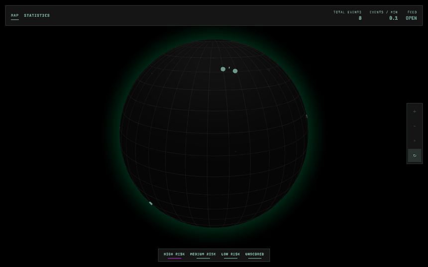

# CyberPulse

A live DDoS threat-intel visualization globe. Ingests public threat-intelligence feeds
(AbuseIPDB, Cloudflare Radar), geolocates and ML-scores reported IPs, and streams the
results to a browser client rendered as an animated 3D globe with a live stats dashboard.

**Live demo:** [cyberpulse-hj9l.onrender.com](https://cyberpulse-hj9l.onrender.com/) — free
Render tier, so expect a cold-start delay on first load and an empty globe until the next
`/blacklist` pull lands (see [Known trade-offs](#known-trade-offs-documented-not-hidden--per-the-prds-non-goals)).



## Problem / why this exists

Public threat-intel maps (Kaspersky Cyberthreat Map, Digital Attack Map) are visually
compelling but closed-source black boxes. This project reproduces the core idea
transparently, end-to-end, with a documented ML component, as a demonstration of:
real-time-feeling data pipelines (polling + WebSocket push), applied ML on security
telemetry (feature engineering, offline training, live inference), geospatial
visualization, and pragmatic full-stack architecture under real free-tier constraints.

**This is explicitly not:**
- A packet-level sniffer. It consumes public, already-aggregated threat intel (AbuseIPDB
  community reports, Cloudflare Radar aggregates) — never raw network traffic.
- A claim of literally "every attack on Earth, live." The feed is a periodically-polled,
  rate-limited sample presented as a live-feeling stream — the same technique real vendor
  maps use (see [Real-time vs. polled](#whats-real-time-vs-polled) below for the exact
  breakdown).
- A production-grade attack detector. It's an educational/demonstration visualization.

## Architecture

```
                         ┌───────────────────────────────────────────────┐
                         │              Single Web Service                │
                         │           (Docker, Render free tier)           │
                         │                                                │
  ┌───────────────┐      │  ┌──────────────────────┐  ┌────────────────┐ │
  │ AbuseIPDB API │◄─────┼──┤ Ingestion Scheduler   │  │  FastAPI app   │ │
  │ /blacklist     │      │  │ (APScheduler)         │  │  - REST routes │ │
  │ (5 req/day)    │      │  │                       │  │  - WebSocket   │ │
  └───────────────┘      │  │ blacklist_pull_cycle  │─►│    hub         │ │
  ┌───────────────┐      │  │  (every ~6h, quota-   │  │  - static      │◄┼── React build
  │ AbuseIPDB API │◄─────┼──┤   guarded) queues new │  │    files       │ │   (globe UI,
  │ /check         │      │  │   IPs into an         │  │    (Vite)      │ │   same origin
  │ (1000 req/day) │      │  │   in-memory backlog   │  └───────┬────────┘ │   in prod)
  └───────────────┘      │  │                       │          │          │
  ┌───────────────┐      │  │ drain_cycle (~30s):   │          │          │
  │ Cloudflare     │◄────┼──┤  pops backlog, geo-   │          │          │
  │ Radar API      │      │  │  locates + scores +   │          │          │
  └───────────────┘      │  │  persists + broadcasts│          │          │
  ┌───────────────┐      │  └──────────┬────────────┘          │          │
  │ Geolocation    │◄────┼─────────────┤                       │          │
  │ (ip-api.com)   │      │             ▼                       ▼          │
  └───────────────┘      │  ┌──────────────────┐    ┌──────────────────┐ │
                         │  │  ML Scorer        │    │  SQLite (file)   │ │
                         │  │  (scikit-learn     │    │  - events        │ │
                         │  │   pickle, loaded    │    │  - geo cache     │ │
                         │  │   once at startup)  │    │  - api quota     │ │
                         │  └──────────────────┘    └──────────────────┘ │
                         └───────────────────────────────────────────────┘
                                          │
                                          ▼
                              Browser client (WebSocket + REST)
                              react-globe.gl + Recharts, dark neon-terminal UI
```
*(`blacklist_pull_cycle` also falls back to Blocklist.de + CINS Army — free, unlimited feeds —
whenever `/blacklist`'s 5-req/day quota is exhausted, which happens in practice since that
quota is shared across every consumer of the same API key. See the table below.)*

- `backend/` — FastAPI app: ingestion pipeline, ML scorer, REST + WebSocket API
- `frontend/` — Vite + React + Tailwind client: globe visualization + stats dashboard
- `ml-research/` — offline Jupyter notebook, a separate resume artifact (not a runtime
  dependency of the live app)

Full spec docs (written before implementation, some points superseded during the build —
see `CLAUDE.md` for what changed and why): [`01_PRD.md`](01_PRD.md),
[`02_TECHNICAL_ARCHITECTURE.md`](02_TECHNICAL_ARCHITECTURE.md),
[`03_SECURITY_AND_ACCESS.md`](03_SECURITY_AND_ACCESS.md),
[`05_FEATURE_TICKETS.md`](05_FEATURE_TICKETS.md).

## What's real-time vs. polled

The globe *feels* continuously live, but it's honest to be specific about what's actually
happening underneath — this is the section to point an interviewer at.

| Layer | Cadence | Mechanism |
|---|---|---|
| Browser ↔ backend event push | Real-time (WebSocket) | Every newly-persisted event is broadcast immediately over `/ws/events`. If you're connected, you see it the instant it's written. |
| New-IP discovery (AbuseIPDB `/blacklist`, falls back to Blocklist.de + CINS Army) | **Polled, ~every 6h** | Capped at 5 requests/day on the free tier (discovered live, not assumed — see `CLAUDE.md`) and shared across every consumer of the same API key, including local dev testing — realistic to exhaust before the live scheduler's turn. Falls back to free, unlimited feeds when that happens; every candidate either way still gets real per-IP data from AbuseIPDB's `/check`. |
| Backlog drain (geolocate → score → persist → broadcast) | Polled, ~every 30s | Pops a few IPs at a time from the batch above, so the globe keeps animating between the infrequent `/blacklist` refreshes instead of going quiet for hours. |
| Cloudflare Radar aggregate trends | Polled, ~every 2.5 min | Aggregate, not per-IP — feeds the stats dashboard only. |
| Frontend stats dashboard | Polled, every 30s | Plain REST polling of `/stats/summary` and `/stats/timeseries` — no WebSocket needed for aggregate rollups. |
| Geolocation | Cached 24h per IP | Avoids re-hitting the free geolocation API for IPs seen recently. |

Net effect: what you watch update in the browser is real (a genuine new database write,
pushed live), but the *rate* at which new source data becomes available is throttled hard
by free-tier API limits — the same constraint every "live" threat map built on public,
non-paid data sources has to work around.

## What the ML model does and doesn't do

Two separate models exist, on purpose, for two different questions:

### Live composite risk scorer (`backend/app/ml/`, runs at inference time)
- **Input:** AbuseIPDB report metadata for each ingested IP — total report count, distinct
  reporter count, days since last report, category tags, usage type (hosting/ISP/other,
  from AbuseIPDB's own field), and a per-country prior.
- **Output:** a 0-100 "DDoS-relevance" score, logistic regression, `class_weight="balanced"`.
- **Label:** there is no live ground truth for "is this really a DDoS source." The model is
  trained against a *proxy* label — AbuseIPDB category 4 ("DDoS Attack") present on the
  IP's reports — which is weak/proxy supervision, named as such rather than hidden. See
  `app/ml/model_card.md` for the full methodology, including a labeling mistake caught and
  fixed mid-project (an early version scored 100% accuracy, which turned out to be feature
  leakage, not skill — documented there in detail).
- **Held-out performance:** ~76% accuracy on a genuinely mixed confusion matrix (not
  memorization) on a small (249-sample), free-tier-constrained training pull.
- **Independently computed, not a pass-through:** correlation with AbuseIPDB's own raw
  confidence score is weak (r ≈ -0.17 on the training set) — this is a different signal,
  not a relabeled copy of AbuseIPDB's number.
- **What it doesn't do:** analyze any raw traffic, guarantee correctness, or claim
  production-grade accuracy. It's a resume-scale demonstration of the full pipeline
  (feature engineering → weak supervision → training → live inference), not a claim of a
  validated attack-detection product.

### Offline showcase notebook (`ml-research/offline_ddos_classifier.ipynb`, not called at runtime)
Trains a Random Forest on **NSL-KDD** (a labeled, flow-based intrusion-detection benchmark —
substituted for the originally-planned CICDDoS2019, which turned out to be access-gated
behind a personal registration form or Kaggle credentials; NSL-KDD is genuinely,
anonymously downloadable, confirmed live) to classify traffic as normal/DoS/probe/R2L/U2R
using **41 real packet/flow-derived features** (byte counts, timing, error rates...) — data
the live system does not have and could not get without running its own packet capture
infrastructure, which is explicitly out of scope (`$0`, third-party-API-only). The
notebook's closing section explains this connection directly: the live system's simpler
feature set isn't a shortcut, it's the actual shape of the data available in a
no-packet-capture architecture.

## Local development

### Backend
```
cd backend
python -m venv venv
./venv/Scripts/activate   # or source venv/bin/activate on macOS/Linux
pip install -r requirements.txt
cp .env.example .env      # fill in API keys, see 03_SECURITY_AND_ACCESS.md
uvicorn app.main:app --reload
```
Visit `http://localhost:8000/health`.

### Frontend
```
cd frontend
npm install
cp .env.example .env
npm run dev
```
Visit `http://localhost:5173`.

### Offline ML notebook
[`ml-research/offline_ddos_classifier.ipynb`](ml-research/offline_ddos_classifier.ipynb) —
see [above](#offline-showcase-notebook-ml-researchoffline_ddos_classifieripynb-not-called-at-runtime)
for what it does and why. Runs top-to-bottom on a fresh environment (verified on a clean
venv with an empty data cache); downloads its own ~7MB of data on first run.
```
cd ml-research
python -m venv venv
./venv/Scripts/activate
pip install -r requirements.txt
jupyter notebook offline_ddos_classifier.ipynb
```

## Deployment

Single `Dockerfile` at the repo root, multi-stage: builds the frontend, then copies the built
assets into the FastAPI backend's `static/` directory, which is served alongside the REST/
WebSocket API from the same origin (Technical Architecture doc section 7 — one service, one
process). Because everything is same-origin in production, the frontend doesn't need a
build-time API URL baked in — it falls back to relative/`window.location`-derived URLs when
`VITE_API_BASE_URL`/`VITE_WS_URL` aren't set (see `frontend/src/lib/apiConfig.ts`), which also
automatically resolves the WebSocket to `wss://` on an `https://` page (no mixed-content
issues).

### Build & run locally
```
docker build -t cyberpulse .
docker run -p 8000:8000 \
  -e IP_HASH_SALT=<generate a long random string> \
  -e ABUSEIPDB_API_KEY=<your key> \
  -e CLOUDFLARE_RADAR_API_TOKEN=<your token> \
  cyberpulse
```
Visit `http://localhost:8000` — same container serves the UI, REST API, and WebSocket.
Verified locally: `/health`, `/events/recent`, static asset serving, and a raw WebSocket
upgrade handshake to `/ws/events` all confirmed working from inside the built image.

### Deploy to Render (free tier)
1. Push this repo to GitHub.
2. In the Render dashboard: **New +** → **Blueprint**, connect the repo. Render reads
   [`render.yaml`](render.yaml) and provisions a Docker web service automatically.
3. Render will prompt for the env vars marked `sync: false` in `render.yaml`
   (`ABUSEIPDB_API_KEY`, `CLOUDFLARE_RADAR_API_TOKEN`, `IPINFO_API_KEY`, `IP_HASH_SALT`,
   `CORS_ALLOWED_ORIGINS`) — fill these in the dashboard, never in a committed file. Once
   Render assigns your service's URL, set `CORS_ALLOWED_ORIGINS` to that exact URL.
4. This step requires your own Render account/credentials, so it isn't something that can be
   done from here — the Dockerfile and blueprint are ready to go, connecting the repo and
   filling in secrets is a dashboard action for you to do.

### Known trade-offs (documented, not hidden — per the PRD's non-goals)
- **Ephemeral filesystem on Render's free tier.** Confirmed against Render's docs: free web
  services have no persistent disk (that's a paid-tier feature) — every redeploy, restart, or
  spin-down wipes the local SQLite file. In practice this means the ingested-event history
  resets periodically; the app already re-ingests from scratch on startup (`init_db()` +
  the scheduler's first poll), so it self-heals rather than erroring, but it's not a durable
  history store on the free tier.
- **Cold starts.** Render's free web services spin down after a period of inactivity and take
  some time to wake on the next request. A stranger opening a cold link may see a brief delay
  before the app responds. An optional free external pinger (e.g. UptimeRobot) hitting `/health`
  periodically can keep the instance warm if continuous responsiveness matters for a demo —
  not set up here, since it's opt-in and has its own trade-offs (counts against free-tier usage
  hours).
- **`/blacklist`'s 5-requests/day quota** (see `CLAUDE.md`) means a freshly-restarted instance
  (which just lost its event history to the ephemeral filesystem) may need to wait for its next
  scheduled `/blacklist` pull to repopulate the globe, rather than doing so instantly — the
  in-memory backlog from before the restart is also gone. This compounds with the ephemeral
  filesystem trade-off above.

## Status
See "Current phase" in [`CLAUDE.md`](CLAUDE.md) for where the build currently stands.
